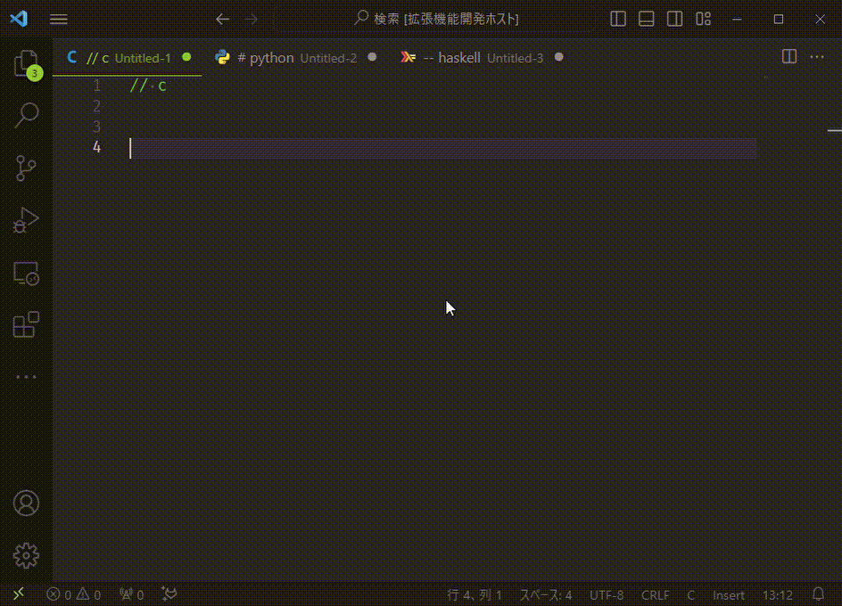

<!-- PROJECT SHIELDS -->
![GitHub release (latest SemVer)][release-shield]![GitHub License][license-shield]

[![Contributors][contributors-shield]][contributors-url][![Forks][forks-shield]][forks-url][![Stargazers][stars-shield]][stars-url]
[![Issues][issues-shield]][issues-url]

[![Paypal][Paypal-shield]][Paypal-url][![BuyMeACoffee][BuyMeACoffee-sheild]][BuyMeACoffee-url]

<!-- PROJECT LOGO -->
 

  <h3 align="center">continue-comment</h3>

  

    add a feature for continuing comment with new line.
     
    <a href="https://github.com/Shumpei-Tanaka/readme-template/issues">Report Bug</a>
    ·
    <a href="https://github.com/Shumpei-Tanaka/readme-template/issues">Request Feature</a>
  

  

    <a href="/README.md">English</a> •
    <a href="/docs/README-ja.md">日本語 (Japanese)</a>
  

## Features

- `Ctrl + Shift + /`: toggle continue-comment mode
- insert comment header when newline automatically
- it can be always on with setting.

## Requirements

no requirements.

## Extension Settings

|name|detail|
|-|-|
|`continue-comment.alwaysOn`| ignore toggle.always on|
|`continue-comment.viewModeAsCursor`|show now mode as cursor style|
|`continue-comment.secondaryCursorStyle`|a cursor style . It use in mode on|

## Known Issues

## Release Notes

### 1.0.0

Initial release of continue-comment.

---

## License

The source code is licensed MIT.

See LICENSE for more information.

## Say Thank You

If my works feels you helpful, I would be happy to have your support for me. :)

links are below.

- [https://www.buymeacoffee.com/s6tanaka](https://www.buymeacoffee.com/s6tanaka)
- [https://www.paypal.me/s6tanaka/](https://www.paypal.me/s6tanaka/)

[![Paypal][Paypal-shield]][Paypal-url][![BuyMeACoffee][BuyMeACoffee-sheild]][BuyMeACoffee-url]

<!-- MARKDOWN LINKS & IMAGES -->
[contributors-shield]: https://img.shields.io/github/contributors/Shumpei-Tanaka/readme-template.svg?style=flat-squere
[contributors-url]: https://github.com/Shumpei-Tanaka/readme-template/graphs/contributors
[forks-shield]: https://img.shields.io/github/forks/Shumpei-Tanaka/readme-template.svg?style=flat-squere
[forks-url]: https://github.com/Shumpei-Tanaka/readme-template/network/members
[stars-shield]: https://img.shields.io/github/stars/Shumpei-Tanaka/readme-template.svg?style=flat-squere
[stars-url]: https://github.com/Shumpei-Tanaka/readme-template/stargazers
[issues-shield]: https://img.shields.io/github/issues/Shumpei-Tanaka/readme-template.svg?style=flat-squere
[issues-url]: https://github.com/Shumpei-Tanaka/readme-template/issues

[release-shield]:https://img.shields.io/github/v/release/Shumpei-Tanaka/readme-template?style=flat-squere&sort=semver
[license-shield]:https://img.shields.io/github/license/Shumpei-Tanaka/readme-template?flat-squere
[Paypal-shield]:https://img.shields.io/badge/paypal.me-s6tanaka-white?style=flat-squere&logo=paypal
[Paypal-url]:https://paypal.me/s6tanaka
[BuyMeACoffee-sheild]:https://img.shields.io/badge/buy_me_a_coffee-s6tanaka-white?style=flat-squere&logo=buymeacoffee&logocolor=#FFDD00
[BuyMeACoffee-url]:https://www.buymeacoffee.com/s6tanaka